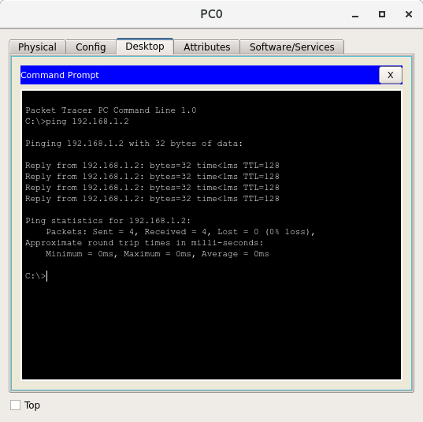
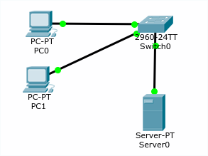
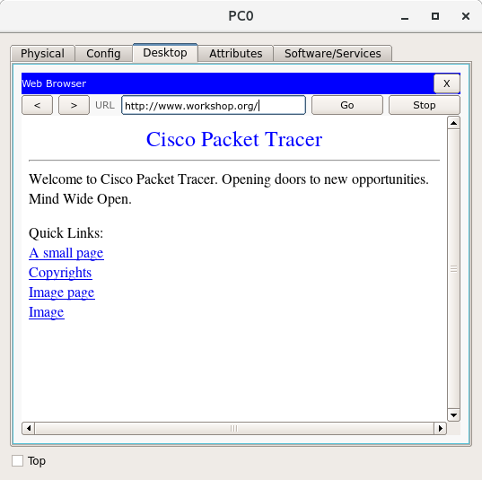

# Labo-oefening Follow the Message

Het doel van deze workshop is de kennis die je in Computernetwerken 1 opgedaan hebt toe te passen. We gaan met PacketTracer een gesimuleerd netwerk opzetten waar waar de belangrijkste concepten die de werking van het Internet mogelijk maken toegepast worden. We beginnen met een eenvoudige opstelling die we stelselmatig uitbreiden.

## Stap 1


- Voeg een switch (Switch0) en twee pc's toe (PC0 en PC1)
- Verbind elke pc via een UTP-kabel met de switch
- Geef beide pc's een IP-adres (Config > FastEthernet0 > IP Address). Achteraan dit document vind je een sjabloon voor een tabel waar je alle IP-adressen in de opstelling kan bijhouden.
- Ga naar op beide pc's naar Desktop > Command prompt en ga na of je de andere pc kan bereiken via `ping <IP-adres>`

{width=8cm}

Aandachtspunten:

- Beide pc's moeten een IP-adres krijgen binnen hetzelfde "subnet", d.w.z. hetzelfde netwerkdeel (bv. 192.168.1), en een verschillend host-deel.
- Beide pc's moeten hetzelfde Subnet Mask hebben (bv 255.255.255.0)

## Stap 2

{width=4cm}

- Voeg een server (Server0) toe aan het netwerk
- Geef die een IP-adres
- Controleer of alle hosts elkaar kunnen pingen
- Op de server zou de service HTTP (webserver) actief moeten zijn. Verifieer dit (Services > HTTP)
- Op één van de pc's, open de webbrowser (Desktop > Web Browser) en tik het IP-adres van de server in de adresbalk in. Je zou een website moeten zien (titel: "Cisco Packet Tracer").
- Activeer de DNS service op de server. Voeg een "A-record" toe met een hostnaam voor je server (bv. "www.workshop.net") en het correcte IP-adres.
- Zorg dat PC0 en PC1 weten dat er een DNS server beschikbaar is via Config > Global Settings en vul het IP-adres van Server0 in.
- Verifieer op één van de pc's dat je de website kan zien door "www.workshop.net" in de adresbalk in te tikken.

{width=8cm}

## Stap 3

In deze stap gaan we een nieuw LAN toevoegen met een pc en een switch, en doorverbinden met het eerste via twee routers.

{width=8cm}

- Vervolledig de opstelling zoals in de figuur aangegeven. Tussen beide routers (Router0 voor het "linkse" netwerk en Router1 voor het "rechtse") wordt een crossover-kabel gelegd (stippellijn).
- Zorg dat alle netwerkinterfaces van de routers een correct IP-adres hebben (zie de Aandachtspunten hieronder).
- Controleer of de pc's de dichtstbijzijnde router kunnen pingen
- Controleer of de routers elkaar kunnen pingen. Ga naar het tabblad CLI. Wellicht zie je een prompt in de vorm van "Router(config-if)#". Geef het commando "exit" totdat de prompt er uitziet als "Router#". Ping vervolgens het IP-adres van de andere router. In de uitvoer is een `.` een mislukte ping en een `!` een geslaagde. Soms komt het voor dat de eerste ping niet doorkomt, maar de andere wel. Voorbeeld:

    ```text
    Router# ping 192.168.3.253

    Type escape sequence to abort.
    Sending 5, 100-byte ICMP Echos to 192.168.3.253, timeout is 2 seconds:
    .!!!!
    Success rate is 80 percent (4/5), round-trip min/avg/max = 0/0/0 ms
    ```

Aandachtspunten:

- Bij een router moet je de netwerkinterface zelf aanzetten (Config > GigabitEthernetX/Y > Port Status aanvinken).
- Het is belangrijk om goed in de gaten te houden welke poorten verbonden zijn met welk netwerk. Om verwarring te vermijden, gebruik volgende systematiek:
    - Verbind bij elke router GigabitEthernet0/1 met GigabitEthernet0/1 van de switch.
    - Verbind de routers onderling via GigabitEthernet0/0.
- Let goed op de systematiek bij het toewijzen van IP-adressen. Binnen elk netwerk moet telkens het netwerkdeel hetzelfde zijn en het host-deel uniek. Je hebt *drie* netwerken:
    - Het "linkse" netwerk, bestaande uit alle apparaten die met Switch0 verbonden zijn;
    - Het "rechtse" netwerk, bestaande uit alle apparaten die met Switch1 verbonden zijn;
    - Het netwerk dat beide routers onderling verbindt via de crossover-kabel.

## Stap 4

Het hele netwerk is nu met elkaar verbonden, maar op dit moment is het nog niet mogelijk dat PC2 in het rechtse netwerk met het linkse communiceert. Verifieer dit door te proberen vanaf PC2 naar Router0 te pingen. In deze stap gaan we de routering in orde brengen.

- Hosts (PC's en Server0) hebben een "Default gateway" nodig (Config > Global Settings). Geef bij elke PC en Server0 als Default gateway de dichtstbijzijnde router (bv. voor PC2 wordt dit Router1).
- Routers kunnen onderling informatie uitwisselen over de netwerken waarmee ze verbonden zijn en welke routes het meest efficiënt zijn voor het doorsturen van data. Eén van de meest eenvoudige router-protocollen is RIP (Routing Information Protocol). Om RIP te initialiseren, ga naar Config > RIP Routing. In het tekstveld "Network" geef je vervolgens de IP-adressen van de twee netwerken waarmee elke router *rechtstreeks* verbonden is en klikt dan telkens op "Add". Merk op dat bij het IP-adres van een netwerk het host-deel "0" is. (bv. 192.168.1.0).

Op dit moment moeten *alle* hosts in het netwerk elkaar kunnen pingen. Verifieer dit (bv. PC2 naar PC0, Server0).

Controleer ook de routetabel van beide routers. Hieronder een voorbeeld voor Router0. Merk op dat de IP-adressen wellicht verschillen met deze die jij gekozen hebt.

```text
Router#show ip route
Codes: L - local, C - connected, S - static, R - RIP, M - mobile, B - BGP
       D - EIGRP, EX - EIGRP external, O - OSPF, IA - OSPF inter area
       N1 - OSPF NSSA external type 1, N2 - OSPF NSSA external type 2
       E1 - OSPF external type 1, E2 - OSPF external type 2, E - EGP
       i - IS-IS, L1 - IS-IS level-1, L2 - IS-IS level-2, ia - IS-IS inter area
       * - candidate default, U - per-user static route, o - ODR
       P - periodic downloaded static route

Gateway of last resort is not set

     192.168.1.0/24 is variably subnetted, 2 subnets, 2 masks
C       192.168.1.0/24 is directly connected, GigabitEthernet0/0
L       192.168.1.254/32 is directly connected, GigabitEthernet0/0
R    192.168.2.0/24 [120/1] via 192.168.3.254, 00:00:23, GigabitEthernet0/1
     192.168.3.0/24 is variably subnetted, 2 subnets, 2 masks
C       192.168.3.252/30 is directly connected, GigabitEthernet0/1
L       192.168.3.253/32 is directly connected, GigabitEthernet0/1
```

- De "Gateway of last resort" staat voor de default gateway. In deze opstelling moet die niet ingesteld zijn.
- Een lijn die met "C" begint is een netwerk dat rechtstreeks verbonden is.
- Een lijn die met "L" begint geeft het lokale IP-adres aan van de overeenkomstige netwerkinterface van de router zelf
- De lijn die met "R" begint werd doorgegeven door de andere router.

Het is ook belangrijk dat hosts weten welke DNS-server ze kunnen ondervragen om hostnamen naar IP-adressen om te zetten (Config > Global Settings > DNS Server). In deze simulatietool vinden hosts een DNS-server op het eigen LAN automatisch, maar in werkelijkheid is dat niet zo. Ook bij PC2 moet je expliciet opgeven dat Server0 de DNS-server is door diens IP-adres in te vullen.

Na deze laatste stap zou het moeten mogelijk zijn om op PC2 in de webbrowser "www.workshop.net" in de adresbalk in te tikken en de website te zien!

## Probleemoplossen

Werkt het niet? Eén van de prioritaire taken van een systeembeheerder is het opsporen en oplossen van problemen in ict-infrastructuur. In eerste instantie is dit wellicht een frustrerend proces, maar door ervaring op te doen word je hier steeds beter in.

Als het probleem ligt bij de configuratie (en niet bv. bij falende hardware), is in principe de oorzaak altijd te vinden, op voorwaarde dat je *systematisch* en *grondig* te werk gaat. Dat betekent dat je telkens dezelfde volgorde aanhoudt, en geen stappen over slaat of veronderstellingen maakt zonder die te testen.

Probeer in PacketTracer de simulatie-modus uit, zo zie je waar je pakketten vastlopen, verdwijnen of de verkeerde kant opgaan...

Enkele aanwijzingen bij het zoeken naar de oorzaak van netwerkproblemen.

- Als je de TCP/IP-protocolstack voor ogen houdt, werk telkens van onder naar boven (bottom-up):
    - Hardware:
        - Is de netwerkkabel correct aangesloten?
        - Heb je het correcte type kabel aangesloten? Bijvoorbeeld van host naar switch: een gewone UTP-kabel; tussen host/router of onderling tussen switches: crossover-kabel.
        - In een fysiek netwerk: werkt de kabel? Controleer met een kabeltester.
        - Branden de LEDs van de netwerkpoort (in PacketTracer: de groene bolletjes aan het einde van de netwerkkabels).
    - Netwerkinterfacelaag:
        - Is de netwerkinterface geactiveerd (Port Status)?
        - Is de juiste netwerkinterface verbonden met de juiste switch?
    - Internetlaag:
        - Is er een IP-adres toegekend? Is het geldig?
        - Hebben alle hosts op hetzelfde LAN hetzelfde netwerkmasker?
        - Is het *netwerkdeel* van de IP-adressen van alle hosts op hetzelfde LAN *identiek*?
        - Is het *host-deel* van de IP-adressen van alle hosts op hetzelfde LAN *uniek*?
    - In deze opstelling is de transport- en applicatielaag niet van belangrijk
- Bij het controleren van de bereikbaarheid van andere hosts op het netwerk, werk stap voor stap. Bijvoorbeeld, bij het controleren van de bereikbaarheid van Server0 vanaf PC2:
    - Ping eerst Router1
    - Ping vervolgens Router0
    - Ping tenslotte Server0
- Een host heeft 3 stukjes informatie nodig om op het netwerk te kunnen:
    - Een correct IP-adres en bijhorend netwerkmasker
    - Een "default gateway"
    - Een DNS-server

## Adrestabel

Hier vind je een adrestabel die je kan aanvullen met de IP-adressen die je kiest voor alle apparatuur in de netwerkopstelling.

| **Host**    | **Interface** | **IP-adres** | **Netwerkmasker** | **Default gateway** |
| :---    | :---               | :---     | :---          | :---:            |
| PC0     | FastEthernet0      |          |               |                 |
| PC1     | FastEthernet0      |          |               |                 |
| Server0 | FastEthernet0      |          |               |                 |
| Router0 | GigabitEthernet0/0 |          |               |  ---            |
|         | GigabitEthernet0/1 |          |               |  ---            |
| Router1 | GigabitEthernet0/0 |          |               |  ---            |
|         | GigabitEthernet0/1 |          |               |  ---            |
| PC2     | FastEthernet0      |          |               |                 |
